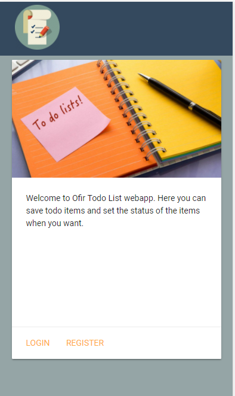
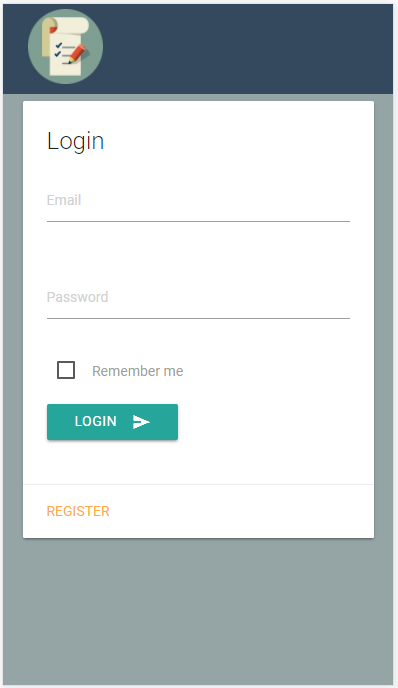
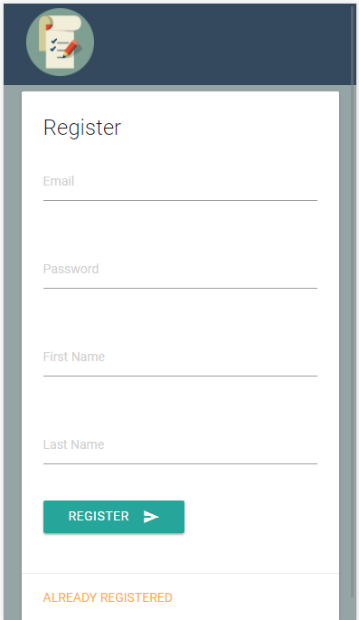
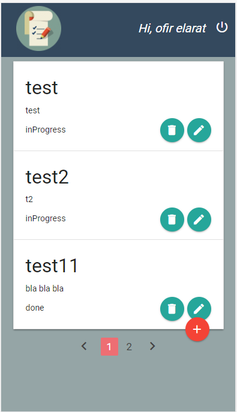

# Todo List Website

[Todo List Website](http://todo-list-project.herokuapp.com)

In this website you will manage your todo items.

## Featurs
- Login / Logout
- Register
- Add todo item
- Delete todo item
- Edit todo item

The website built with JAVA for the server side and use this technogolies:  
- Spring Framwork
- Maven
- MySQL
- Hibernate ORM
- Materializecss

## Screenshots

 

 
 
 
 
 

